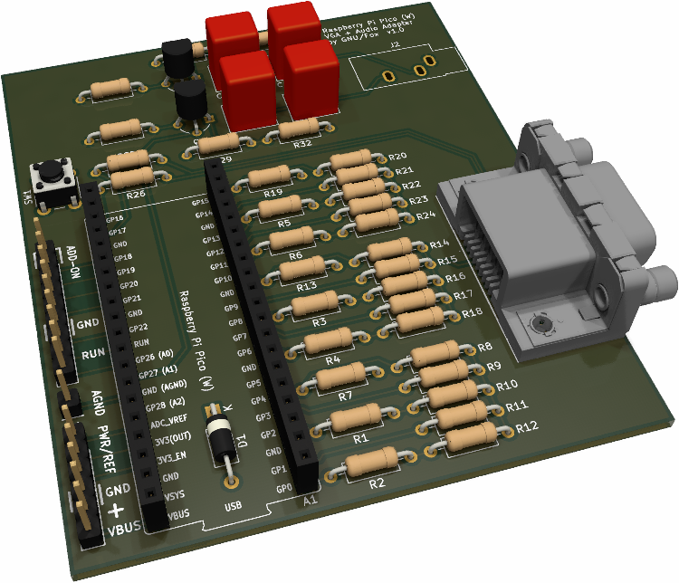

# Cheapo Demo Board

This is an attempt at creating a cheap and easy to assemble adapter board for the Raspberry Pi pico (W) to run VGA and PWM-audio demos.

## Key features
* VGA output via 15-pin SUB-D connector
* Stereo Audio output via 3.5mm jack
* Powered via micro-USB port on pico board or add-on-pin-header
* __Only use two different types of resistors for VGA DAC__
* Easy to assemble THT variant

## TODOs:
 - [ ] Add License
 - [ ] make SMD variant
 - [ ] correct part names in schematic + add BOM